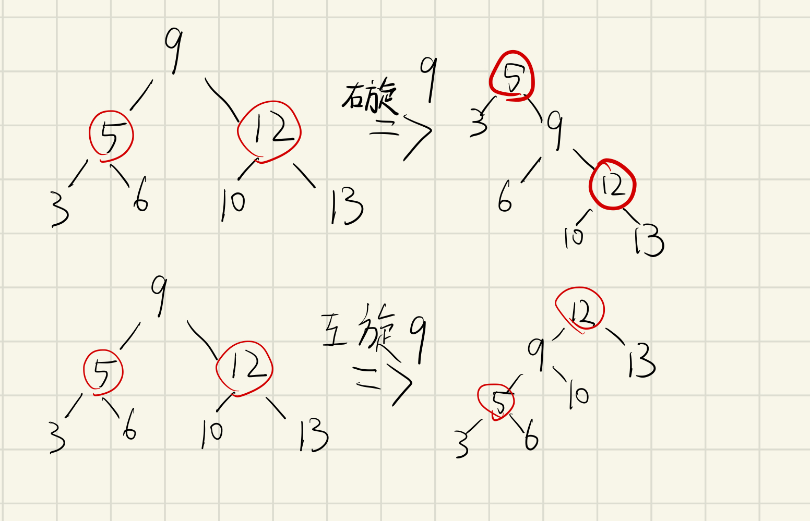
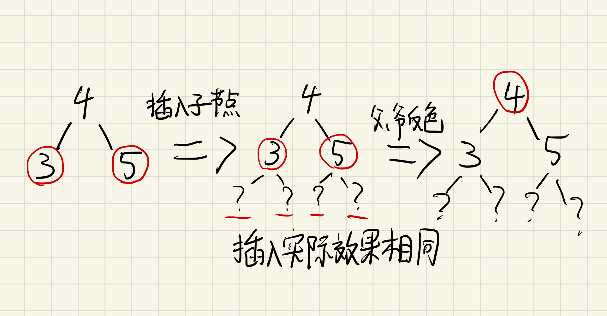

# 树

## 二叉查找树

1.任意节点的左子树若不为空，那么左子树上的所有节点均小于等于该节点的值
2.任意节点的右子树若不为空，那么右子树上的所有节点均大于等于该节点的值
3.任意节点的左右子树也均为二叉搜素树

1. 排列方式，插入节点与当前节点比较，插入节点小的位于左边，大的位于右边

- 优点

查询时间复杂度在o(logn) 

- 缺点

如果插入元素按大小排序时，可以会生成线性树，时间复杂度仍为o(n)

## 2-3树

红黑树的雏形，排序规则遵照二叉树，节点上最多可以有3个树叉，该节点可以有两个元素，中间树叉介于两个元素大小之间

## 红黑树

**红黑树是一种含有红黑两种结点并且能够自平衡的二叉查找树**

特性

>1. 每个节点要么是红色，要么是黑色。
>
>2. 根节点是黑色的。
>
>3. 如果一个节点是红色的，那么它的父节点一定是黑色的（即：一条边的两端不能同时为红色）。
>
>4. 红色节点要么没有孩子，要么有两个黑色的孩子。
>
>5. 从根节点到每个叶节点的路径中，黑色节点的数量（计数时包含叶。但是否含根不影响结果）一定是一样的（比如上图中，从根节点7走到节点3，经过了3个黑色的节点（7, 4, 2），从7到14也经过了3个黑色的节点（7, 9, 14））。
>   ————————————————
>    版权声明：本文为CSDN博主「枫铃树」的原创文章，遵循CC 4.0 BY-SA版权协议，转载请附上原文出处链接及本声明。
>    原文链接：https://blog.csdn.net/m0_62405272/article/details/122612246

### 旋转和变色

保证红黑树特性需要做的操作，旋转后依旧保持平衡二叉树特性。

例子：  

右旋：旋转节点的左孩子变为父节点，左孩子的右孩子替换成旋转节点的左孩子，旋转节点父节点左孩子变为旋转节点的左孩子

左旋：情况同右旋相反                                               

变色

当前节点颜色取反，如果当节点和子节点都为红色，父节点为黑色时，变色将当前节点和兄弟节点变黑色，上级节点变红色。

### 插入流程

1. 默认插入节点为红色，如果是黑色，不符合特性5（所有路径黑色节点数量一致）

2. 如果父节点为黑色，插入后无需做任何操作，红色节点插入不会破坏5大特性

3. 如果父节点为红色，叔叔节点不存在或为红色（实际情况中叔叔节点可能为黑色，由于修复树操作导致）

   > - 父节点一定不是根（因为性质2 根节点是黑色）。
   > - 兄弟节点一定不存在（否则会违背性质4 红色节点没有子节点或者子节点有两个）。
   > - 爷爷节点一定是黑色（否则这棵树在插入前就已经违背性质3了 红色节点父节点必为黑色）。
   > - 叔叔节点要么不存在，要么是红色（否则会违背性质5 所有路径黑色节点数量一致）。
   >
   > 当叔叔节点存在且红色时，插入节点将父级和爷爷级反色。
   >
   > 
   >
   > 因为可能太爷爷级也为红色，此时将爷爷视为新插入节点，此时叔叔节点可能为黑色。
   >
   > 此时为四种情况
   >
   > 

### 删除流程

https://blog.csdn.net/m0_62405272/article/details/122631653

1. 删除节点无子节点（红黑都支持）
2. 删除节点有一个子节点（仅黑节点可能，且子节点为红色） 删除节点和子树中的后继节点交换，一个到换成叶子结点，删除（参考1.）
3. 删除节点有两个子节点（红黑都支持） 删除节点和子树中（左右都可以，hashmap中与右子节点）的后继节点交换，一个到换成叶子结点，删除（参考1.）

### 恢复平衡

修复失衡的黑色节点。即：在节点3的父亲看来，如果往其另一个孩子的方向一路走到叶子，会经历n个黑色节点，那么往节点3这个方向一路走到叶子，会经历n-1个节点。
 我们希望英明的爷爷可以通过一些操作，使得从两个方向 走到叶节点都经过n个节点。
 当然，如果爷爷办不到的话，希望他能让往两个方向走到叶节点都经过n-1个节点，这样从它的角度看，维持了一个新的局部平衡，然后再向它的更上级求助1
