# 目的

通过`jenkins`实现`KIAM`的自动化部署，达到持续集成的目的。当前实现效果是开发者开发代码提交`MR`后，待管理员审核完毕合并`MR`后，自动升级到测试环境中。

#Jenkins搭建自动部署任务

## 登录jenkins


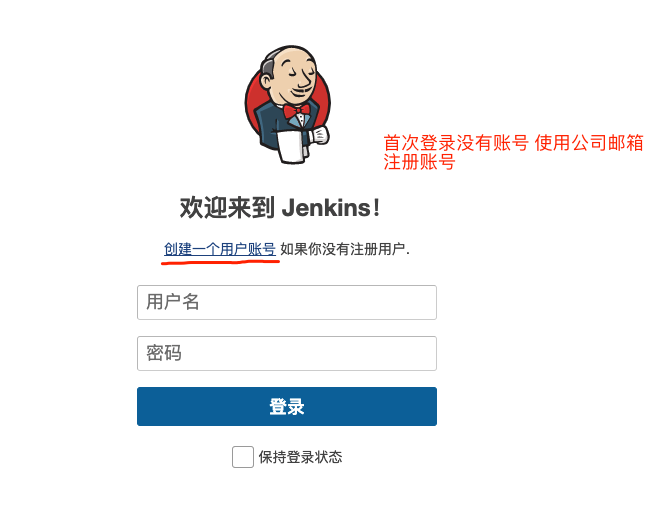

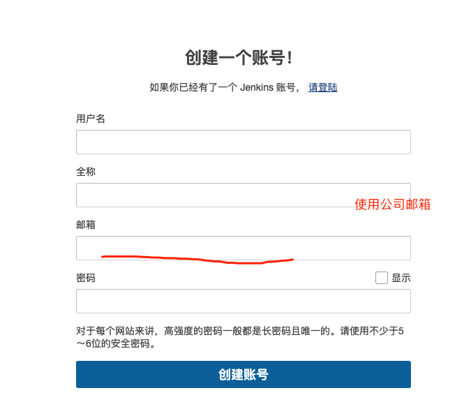

登录成功以后，选择 **KIAM-公安行业版自测环境** ，为公安项目的主要模块

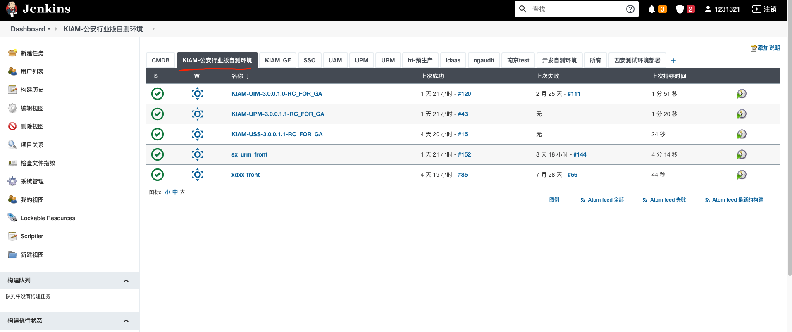

## 构建一个kiam的自动部署任务

`Jenkins`使用公司环境的 **10.2.0.3:3000** 服务

这里以`kiam-upm`为参考项目，从头构建一个自动部署任务

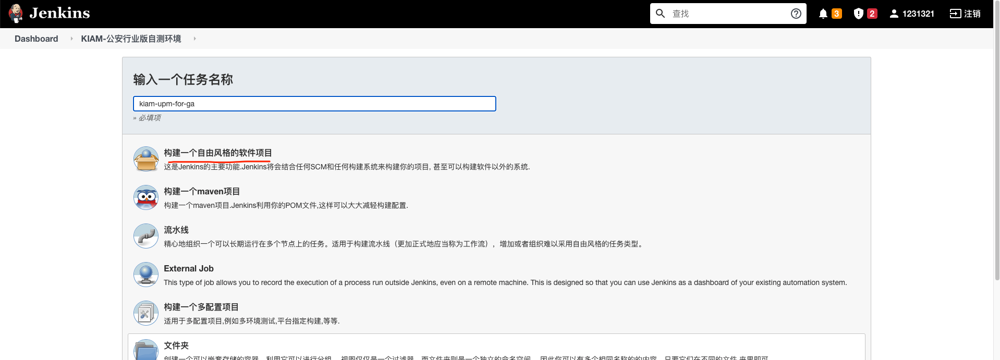

也可以直接以现有项目为模版，快速构建项目

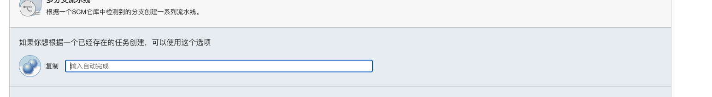

### 1. 设置`General`

在`GitLab Connection`中执行连接为 **CMDB**

> 设置任务描述，指定连接的`GitLab`

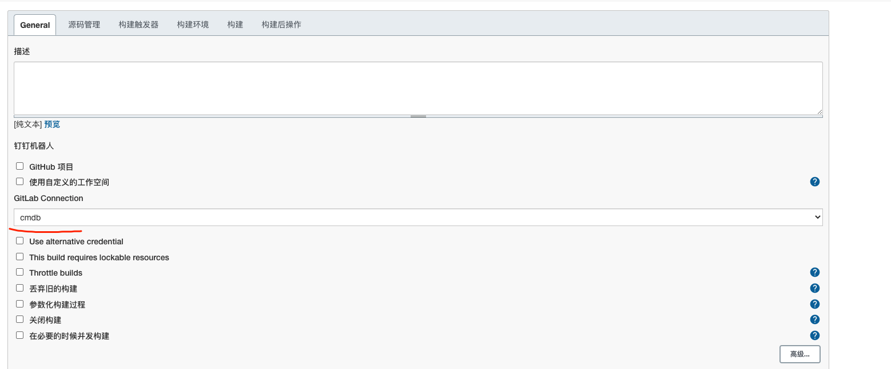

### 2. 设置`源码管理`

> 配置指定的 **git仓库** ，项目根据该仓库进行自动化部署

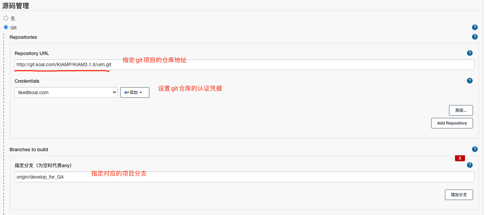

### 3. 构建触发器

> 通过创建触发器，在 **git仓库** 进行操作时，能通触发自动部署操作。触发器正常工作需要在 `git仓库` 对应服务内配置对应的hooks

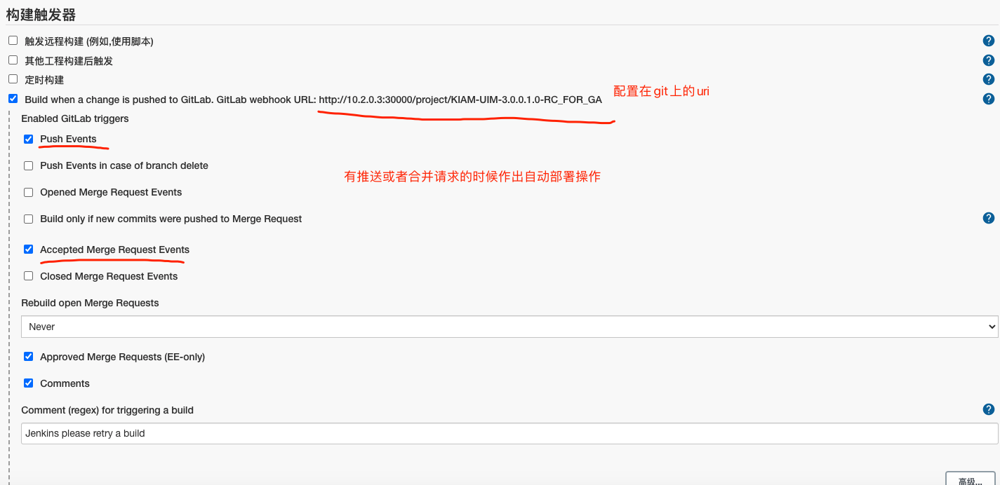


### 4.构建项目升级包

> 这一步通过`jenkins`支持的`gradle`脚本来打包项目升级包，在`jenkins`中任务执行时，所有任务在同一行执行，所以需要在gradle脚本的任务中编写好需要的任务，再再`jenkins`中进行脚本的配置。
>
> `kiam`目前使用``springboot`启动，可以通过`gradle`自带的`bootjar`任务进行打包，脚本如下
>
> ```shell
> #清理当前环境下编译文件
> clean
> #执行任务，并设置连接远程仓库的超时时间，防止连接不上仓库而一直等待阻塞任务
> bootJar -x test -Dorg.gradle.internal.http.socketTimeout=300000
> ```
>
> 运行的实际效果
>
> ```shell
> [KIAM-UIM-3.0.0.1.0-RC_FOR_GA] $ /opt/gradle/bin/gradle clean booJar -x test -Dorg.gradle.internal.http.socketTimeout=300000 -b /var/lib/jenkins/workspace/KIAM-UIM-3.0.0.1.0-RC_FOR_GA/backend/build.gradle
> ```
>
> 

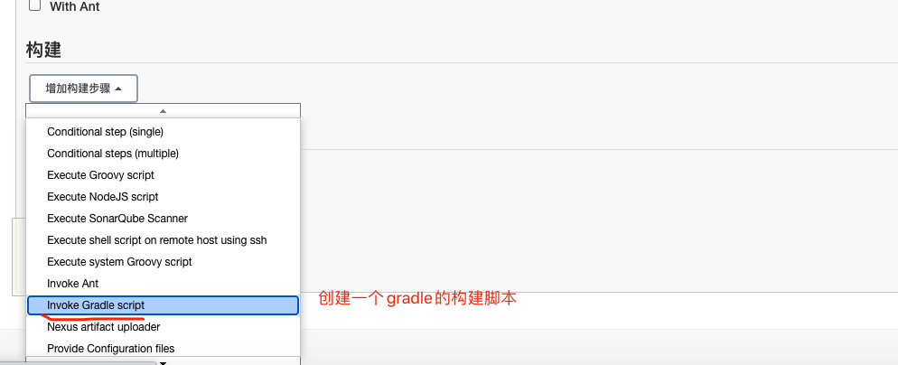

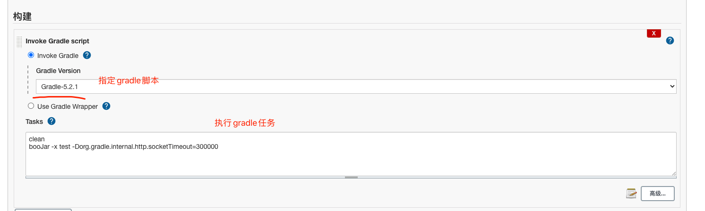

### 5.构建后操作

> 将打包的项目升级到测试环境中。升级完成后需要执行指定脚本,用于重启服务。
>
> ```shell
> #！/bin/bash
> export JAVA_HOME=/usr/local/jdk1.8.0_131
> export KIAM_HOME=/opt
> cd /opt/products/upm/bin
> echo "关闭服务......."
> sh shutdown.sh
> echo "启动服务"
> sh startup.sh
> ```

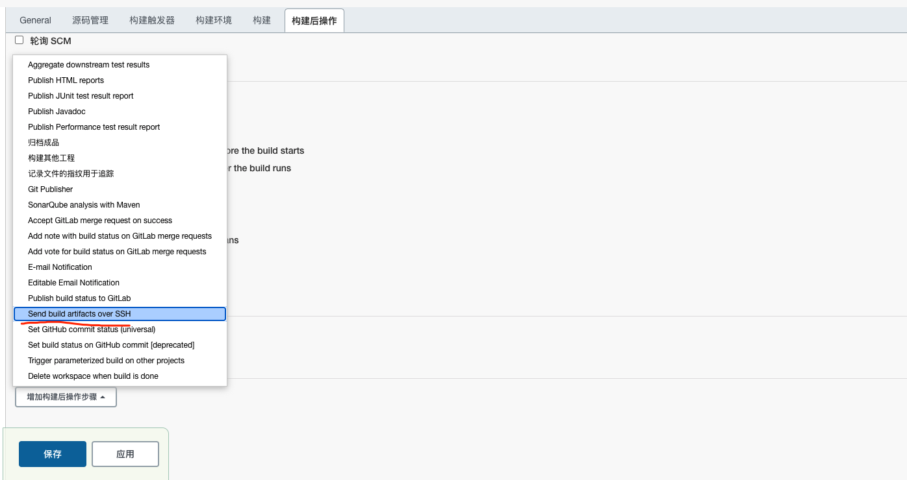

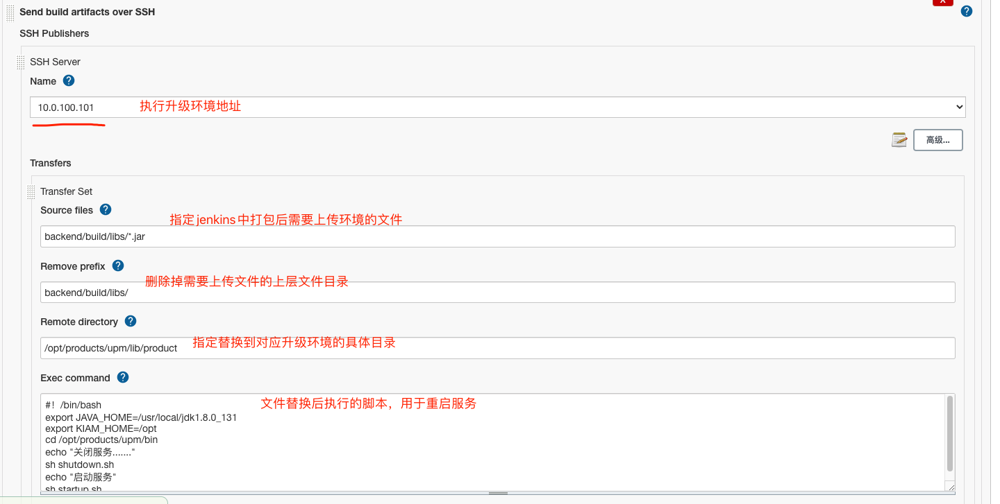

