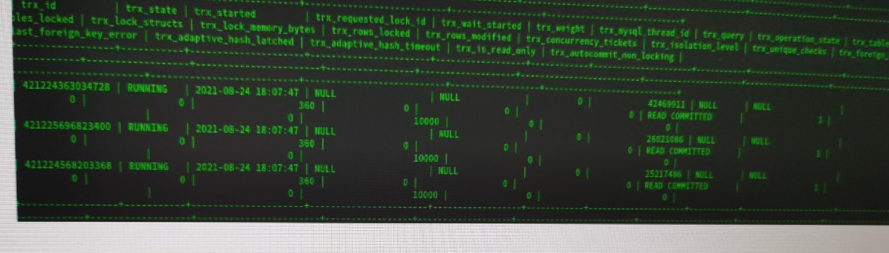
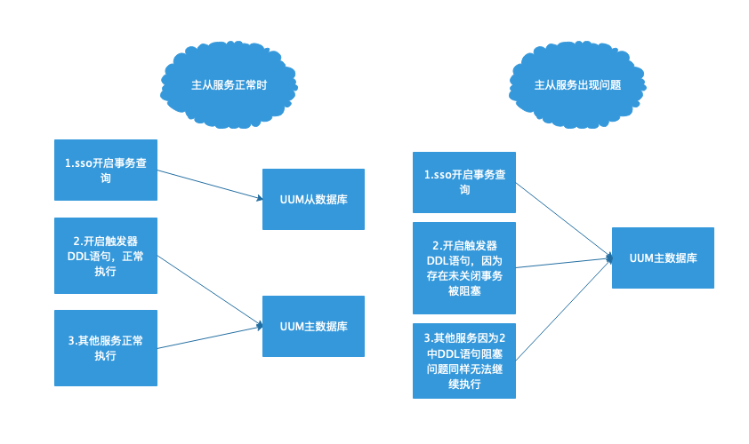

#故障说明

​		因为项目上服务系统的数据库发生故障，影响全局业务应用运行，研发人员通过show processlist命 令，显示数据库存在大量“waitting for table metadata lock”请求。经过云平台运维人员协助查看后，系统反馈监测到有三个未提交的事务⻓时间未关闭，以及和另一个服务对数据库进行触发器的添加和删除操作，可能是导致数据库读写分离失效，以及服务系统的数据库阻塞无法查询的原因。

# 问题排查

​		检查代码发现，有日志处理代码会开启服务系统的数据库事务，并且在用户登录次数到达一定人数时才会提交事务(导 致事务⻓时间未关闭)，但只会进行 **读** 操作。初步怀疑是这块代码导致的，停用该块业务逻辑后，系统正常运行，初步判断是事务未关闭导致数据库存在阻塞或死锁问题。

# 问题分析

## mysql事务了解

首先了解一下mysql支持的事务隔离级别，mysql支持sql规范的四种隔离界别

| 隔离级别           | 脏读         | 不可重复读   | 幻读                                                 |
| ------------------ | ------------ | ------------ | ---------------------------------------------------- |
| `READ UNCOMMITTED` | Possible     | Possible     | Possible                                             |
| `READ COMMITTED`   | Not Possible | Possible     | Possible                                             |
| `REPEATABLE READ`  | Not Possible | Not Possible | Possible<br/>(**mysql通过MVCC可以实现Not Possible**) |
| `SERIALIZABLE`     | Not Possible | Not Possible | Not Possible                                         |

mysql默认的存储引擎为innodb，后面的介绍都是机遇innodb讲解的，mysql的默认事务等级为`REPEATABLE READ`，可以通过修改配置文件或sql语句设置的方式改变事务等级，这里不做介绍。

## 不同事务隔离级别的实现机制

`READ UNCOMMITTED`

由于可以读到未提交事务修改过的记录，所以直接读取记录的最新版本，所以不存在读取时**不存在死锁问题**。

`READ COMMITTED`和`REPEATABLE READ`

为了保证每次读取的记录都是事务中已提交的，需要通过 **ReadView** 控制，每次开启事务后，会生成一份 **ReadView** ，表记录从当前 **ReadView** 中读取，所以读取不会对表进行锁操作，也 **不会造成死锁问题** 。

`SERIALIZABLE`

每次事务中进行读操作都加锁，可能造成 **死锁问题** 。

## 锁解析

为了保证`写-写`、`读-写`或`写-读`操作相互阻塞，mysql设计了两种锁

- `共享锁`，英文名：`Shared Locks`，简称`S锁`。在事务要读取一条记录时，需要先获取该记录的`S锁`，当该记录存在`S锁`时，无法再获取`X锁`,但是其他事务可以继续获取`S锁`。
- `独占锁`，也常称`排他锁`，英文名：`Exclusive Locks`，简称`X锁`。在事务要改动一条记录时，需要先获取该记录的`X锁`

| 兼容性 | `X`    | `S`    |
| ------ | ------ | ------ |
| `X`    | 不兼容 | 不兼容 |
| `S`    | 不兼容 | 兼容   |

### 读操作获取锁的方式

获取`S锁`

```sql
SELECT ... LOCK IN SHARE MODE;
```

获取`X锁`

这种关键字的 **读** 操作让其他事务等待当前`X锁`的释放，造成阻塞

```sql
SELECT ... FOR UPDATE;
```

### 写操作获取锁的方式

获取`S锁`

> 不存在

获取`X锁`

> `UPDATE`和`DELETE`操作

`INSERT`操作不获取锁，会存在`隐式锁`保证事务级别

InnoDB一般情况下不会主动提供表锁，获取表级别锁的关键词如下

- `LOCK TABLES t READ`：`InnoDB`存储引擎会对表`t`加表级别的`S锁`。
- `LOCK TABLES t WRITE`：`InnoDB`存储引擎会对表`t`加表级别的`X锁`。

### 行锁类型

- `Record Locks`：给对应记录加锁，可以防止脏读和不可重复读
- `Gap Locks`：在记录间隙加锁，可以防止幻读
- `Next-Key Locks`：包含上两个锁的功能，能锁住记录间隙和对应记录
- `Insert Intention Locks`：当有多个事务同时需要获取同一个`Gap Locks`时，通过该锁进行排队等待
- `隐式锁`：insert语句默认不会加锁，但是如果有其他事务中获取到其他事务中为提交的insert记录时，会判断是否有未提交语句，如果有的话会给对应事务加上`X锁`，并进入等待状态。

### 表级别锁

​		表级别的`S锁`、`X锁`在对某个表执行`SELECT`、`INSERT`、`DELETE`、`UPDATE`语句时，`InnoDB`存储引擎是不会为这个表添加表级别的`S锁`或者`X锁`的。

​		另外，在对某个表执行一些诸如`ALTER TABLE`、`DROP TABLE`这类的``DDL``语句时，其他事务对这个表并发执行诸如`SELECT`、`INSERT`、`DELETE`、`UPDATE`的语句会发生阻塞，同理，某个事务中对某个表执行`SELECT`、`INSERT`、`DELETE`、`UPDATE`语句时，在其他会话中对这个表执行``DDL``语句也会发生阻塞。这个过程其实是通过在`server层`使用一种称之为`元数据锁`（英文名：`Metadata Locks`，简称`MDL`）东东来实现的，一般情况下也不会使用`InnoDB`存储引擎自己提供的表级别的`S锁`和`X锁`。

### 总结

​		在mysql的innodb存储引擎中，事务隔离级别在`READ UNCOMMITTED`，`READ COMMITTED`，`REPEATABLE READ`时，在事务中进行 **读** 操作不会对其他事务造成影响。使用`SERIALIZABLE`隔离级别时，在事务中进行 **读** 操作时会拿到`S锁`，影响其他事务中的 **写** 操作获取 `X锁` 造成阻塞。

​		当进行`DDL`语句操作时，如果存在未关闭事务，`DDL`语句为了拿到`元数据锁`会进行等待，造成后续 **读写** 操作阻塞。

## 问题场景分析

​		根据现场给出的事务表的记录可以看出，当前事务隔离级别为`READ COMMITTED`,不存在默认加锁的问题，且trx_rows_locked字段值均为0，不存在被锁的记录，所以可以判断不是事务中的查询语句导致的数据库产生阻塞。



​		重新排查问题，现场反馈执行`show processlist`命令，出现大量`waitting for table metadata lock`请求，查找资料后得知MySQL在进行`alter table`等`DDL`操作时，有时会出现`Waiting for table metadata lock`的等待场景，原因是有**未提交事务**，导致`DDL`阻塞。现场反馈在故障时间点发现时，查询到`drop trigger`和`create trigger`操作。可以判断是这个原因导致的。



### 本地测试结果

2. 开启查询事务,并且不关闭

```sql
mysql> select * from hero;
ERROR 1046 (3D000): No database selected
mysql> select * from act_demo.hero;
+--------+---------+---------+
| number | name    | country |
+--------+---------+---------+
|      1 | 刘备    | 蜀      |
|      2 | 曹操    | 魏      |
|      3 | 曹操3   | 魏3     |
|      4 | 曹操4   | 4       |
|      5 | 曹操5   | 5       |
|      6 | 曹操6   | 6       |
|      7 | 曹操7   | 7       |
|      8 | 曹操8   | 8       |
+--------+---------+---------+
8 rows in set (0.00 sec)
```

2. 执行触发器操作语句，触发器耗时88s，与当前`wait_timeout`时间基本一致，可以判断是查询事务超时断开链接后，触发器语句才能执行成功。

```sql
mysql> drop trigger act_demo.t_hero;
Query OK, 0 rows affected (1 min 23.05 sec)
mysql> show variables like 'wait_timeout'
    -> ;
+---------------+-------+
| Variable_name | Value |
+---------------+-------+
| wait_timeout  | 100   |
+---------------+-------+
1 row in set (0.00 sec)
```

3. 在触发器执行时查询对应线程和事务表，可以发现其他**查询事务(在触发器操作阻塞时开启的事务)**和**`DDL`操作**都处于阻塞状态，且只有最初的查询事务处于开启状态。

```sql
mysql> show PROCESSLIST;
+------+------+-----------+----------+---------+------+---------------------------------+------------------------------------------------------------------------------+
| Id   | User | Host      | db       | Command | Time | State                           | Info                                                                         |
+------+------+-----------+----------+---------+------+---------------------------------+------------------------------------------------------------------------------+
| 1823 | root | localhost | NULL     | Query   |  135 | Waiting for table metadata lock | create TRIGGER act_demo.t_hero BEFORE INSERT ON hero FOR EACH ROW SET @sum=1 |
| 1824 | root | localhost | act_demo | Query   |    0 | starting                        | show PROCESSLIST                                                             |
| 1825 | root | localhost | act_demo | Query   |   56 | Waiting for table metadata lock | select * from hero                                                           |
+------+------+-----------+----------+---------+------+---------------------------------+------------------------------------------------------------------------------+
3 rows in set (0.00 sec)

mysql> select * from information_schema.innodb_trx;
+-----------------+-----------+---------------------+-----------------------+------------------+------------+---------------------+---------------------------------------------+---------------------+-------------------+-------------------+------------------+-----------------------+-----------------+-------------------+-------------------------+---------------------+-------------------+------------------------+----------------------------+---------------------------+---------------------------+------------------+----------------------------+
| trx_id          | trx_state | trx_started         | trx_requested_lock_id | trx_wait_started | trx_weight | trx_mysql_thread_id | trx_query                                   | trx_operation_state | trx_tables_in_use | trx_tables_locked | trx_lock_structs | trx_lock_memory_bytes | trx_rows_locked | trx_rows_modified | trx_concurrency_tickets | trx_isolation_level | trx_unique_checks | trx_foreign_key_checks | trx_last_foreign_key_error | trx_adaptive_hash_latched | trx_adaptive_hash_timeout | trx_is_read_only | trx_autocommit_non_locking |
+-----------------+-----------+---------------------+-----------------------+------------------+------------+---------------------+---------------------------------------------+---------------------+-------------------+-------------------+------------------+-----------------------+-----------------+-------------------+-------------------------+---------------------+-------------------+------------------------+----------------------------+---------------------------+---------------------------+------------------+----------------------------+
| 421842217076528 | RUNNING   | 2021-09-07 18:30:09 | NULL                  | NULL             |          2 |                1824 | select * from information_schema.innodb_trx | NULL                |                 0 |                 1 |                2 |                  1136 |               9 |                 0 |                       0 | SERIALIZABLE        |                 1 |                      1 | NULL                       |                         0 |                         0 |                0 |                          0 |
+-----------------+-----------+---------------------+-----------------------+------------------+------------+---------------------+---------------------------------------------+---------------------+-------------------+-------------------+------------------+-----------------------+-----------------+-------------------+-------------------------+---------------------+-------------------+------------------------+----------------------------+---------------------------+---------------------------+------------------+----------------------------+
1 row in set (0.00 sec)
```

#问题解决

1. 在业务代码中，对可能长时间不关闭的事务要有超时断开机制。
2. 单纯的查询类型的sql语句尽量不开启事务。
3. mysql的`wait_timeout`时间不要设置过长，会导致连接一直不释放，造成未知的阻塞。

4. 出现`Waiting for table metadata lock`时，在**information_schema.innodb_trx**表中找出未完成的事务`trx_mysql_thread_id`,并执行`kill {trx_mysql_thread_id} `

# 其他数据库的事务比较

### ORCLE

仅支持两种事务隔离级别：READ COMMITED, SERIALIZABLE

| 隔离级别         | 脏读         | 不可重复读   | 幻读         |
| ---------------- | ------------ | ------------ | ------------ |
| `READ COMMITTED` | Not Possible | Possible     | Possible     |
| `SERIALIZABLE`   | Not Possible | Not Possible | Not Possible |

#### SERIALIZABLE死锁测试(结论不会死锁)

测试过程和**达梦数据库**相同，在此不再贴出

#### `DDL`语句事务阻塞测试

存在事务时进行`DDL`语句测试，oracle会快速报错

```sql
SQL> alter table classinfo modify(classname varchar(11));
alter table classinfo modify(classname varchar(11))
            *
ERROR at line 1:
ORA-00054: resource busy and acquire with NOWAIT specified or timeout expired
```

### 总结

​		ORACLE事务中的 **读** 操作不会对其他事务造成阻塞影响，`DDL`语句也不会因为事务造成阻塞，但是会快速报错。

### 达梦数据库

| 隔离级别           | 脏读         | 不可重复读   | 幻读         |
| ------------------ | ------------ | ------------ | ------------ |
| `READ UNCOMMITTED` | Possible     | Possible     | Possible     |
| `READ COMMITTED`   | Not Possible | Possible     | Possible     |
| `REPEATABLE READ`  | Not Possible | Not Possible | Possible     |
| `SERIALIZABLE`     | Not Possible | Not Possible | Not Possible |

#### SERIALIZABLE死锁测试(结论不会死锁)

达梦数据库事务不用声明`begin`,只需要在语句执行后声明`COMMIT`

开启事务A,先进行一个查询语句

```sql
SQL> SET TRANSACTION ISOLATION LEVEL SERIALIZABLE;
executed successfully
used time: 4.915(ms). Execute id is 827928.
SQL> select * from classinfo;

LINEID     classid classname
---------- ------- ---------
1          2       2

used time: 3.566(ms). Execute id is 827965.
```

再开启事务B,对该条记录进行修改，此时未发生阻塞，修改生效

```sql
SQL> SET TRANSACTION ISOLATION LEVEL SERIALIZABLE;
executed successfully
used time: 6.076(ms). Execute id is 827875.
SQL> update classinfo set classname = '333' where classid = 2;
affect rows 1
```

回到事务A,在进行一个查询语句,结果没变，说明`SERIALIZABLE`隔离机制生效

```sql
SQL> SET TRANSACTION ISOLATION LEVEL SERIALIZABLE;
executed successfully
used time: 4.915(ms). Execute id is 827928.
SQL> select * from classinfo;

LINEID     classid classname
---------- ------- ---------
1          2       2

used time: 3.566(ms). Execute id is 827965.
SQL> select * from classinfo;

LINEID     classid classname
---------- ------- ---------
1          2       2

used time: 0.490(ms). Execute id is 828043.
```

#### `DDL`语句事务阻塞测试

达梦数据库在存在事务时，`DDL`语句执行成功

开启事务A执行查询

```sql
SQL> select * from classinfo;

LINEID     classid classname
---------- ------- ---------
1          1       1
2          2       333
```

在新会话中进行`DDL`操作，成功执行

```sql
SQL> ALTER TABLE classinfo MODIFY classname varchar(8) ;
executed successfully
```

### 总结

​		达梦数据库的事务中的 **读** 操作不会对其他事务造成阻塞影响，`DDL`语句也不会因为事务造成阻塞。`DDL`语句执行成功时，不会影响当前事务的查询。

### 其他事务模式

这两种数据库还支持`READ ONLY`，只读模式，只读事务只能访问数据，但不能修改数据。并且只读事务不会改变事务原有的隔离级。

- `oracle`

```
alter database open read only;
```

- `达梦`

```
SET TRANSACTION READ ONLY;
```

